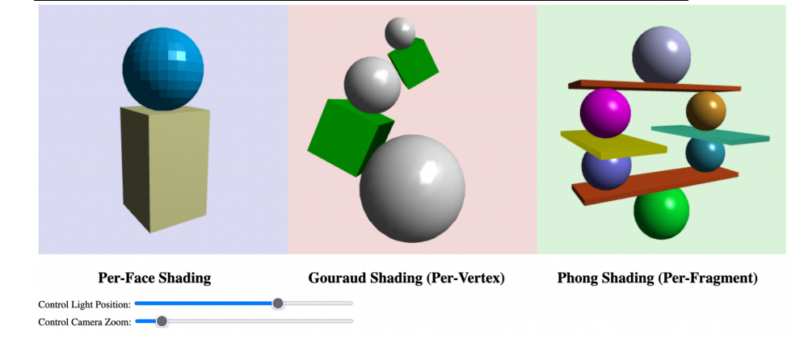

# Introduction to Computer Graphics Assignments (CS360)

This repository contains a series of four assignments for a CS360 Computer Graphics course. These projects are implemented from scratch using WebGL and JavaScript, covering fundamental concepts from 2D transformations to advanced 3D shading, texturing, and shadow mapping.

**Core Technologies:** WebGL, JavaScript, GLSL (GL Shader Language), and the `glMatrix.js` library.

---

## Assignment 1: 2D Scene Rendering & Animation

[cite_start]This project involved rendering a 2D animated scene using only three basic shapes: triangles, squares, and circles[cite: 82, 94]. [cite_start]All objects in the scene, like the house, car, and windmills, are constructed by applying affine transformations (translation, rotation, scaling) to these basic primitives[cite: 83].

**Key Features:**
* Hierarchical modeling to build complex objects (e.g., house, windmills) from simple shapes[cite: 109].
* Simple animations, including rotating windmill blades and a boat moving back and forth on the river[cite: 97, 98].
* UI buttons to toggle the rendering mode between solid surfaces (`gl.TRIANGLES`), wireframes (`gl.LINE_LOOP`), and points (`gl.POINTS`) [cite: 102-105].

---

## Assignment 2: 3D Rendering & Shading Models

[cite_start]This assignment focused on implementing and comparing three fundamental shading algorithms[cite: 27]. [cite_start]The canvas is split into three distinct viewports, with each viewport rendering 3D objects using a different shading technique[cite: 29, 34].

**Key Features:**
* [cite_start]**Flat (Per-Face) Shading:** Lighting calculations are performed once per face[cite: 27, 34].
* [cite_start]**Gouraud (Per-Vertex) Shading:** Lighting is calculated in the vertex shader and interpolated across the face[cite: 27, 34].
* [cite_start]**Phong (Per-Fragment) Shading:** Lighting is calculated for every pixel in the fragment shader, providing smooth specular highlights[cite: 27, 34].
* [cite_start]Interactive viewport-specific mouse controls for object rotation[cite: 30, 32].
* [cite_start]UI sliders to control the light's X-position and the camera's Z-axis zoom[cite: 39, 40].

---

## Assignment 3: Texture & Environment Mapping

[cite_start]A comprehensive project to demonstrate advanced texturing techniques, including 2D texture mapping, cubemap environment mapping (for reflections and refractions), and skyboxes[cite: 126, 127].

**Key Features:**
* [cite_start]**Skybox:** A skybox is rendered by mapping six environment textures onto the inside faces of a large cube[cite: 136].
* [cite_start]**Environment Reflection:** A teapot is rendered as a perfect mirror reflecting the skybox[cite: 140]. [cite_start]A second sphere blends this reflection with its own Phong-shaded color[cite: 141, 142].
* [cite_start]**Environment Refraction:** A "glass" block is simulated by using the `refract()` function in the shader to sample the cubemap, mimicking light bending through it[cite: 147, 148, 150].
* [cite_start]**2D Texture Mapping:** Standard texture mapping is applied to the globe [cite: 144] [cite_start]and the wooden tabletop[cite: 153].
* [cite_start]**Alpha Channel Texturing:** A texture with an alpha channel is used to discard fragments on a cube, creating a "cage" effect[cite: 145].

---

## Assignment 4: Shadow Mapping

[cite_start]This assignment involved implementing a dynamic shadow map algorithm using a two-pass rendering technique[cite: 3]. [cite_start]This method, based on rasterization, creates realistic, hard shadows for 3D objects in a scene[cite: 4].

**Key Features:**
* **Two-Pass Rendering:**
    1.  **Depth Pass:** The scene is first rendered from the light's point of view, storing only the depth information in a shadow map (a texture).
    2.  **Render Pass:** The scene is rendered from the camera's view. Each fragment's position is compared to the depth stored in the shadow map to determine if it is in shadow.
* [cite_start]An interactive slider controls the light's X-position, causing the shadows to update dynamically in real-time[cite: 13, 16].
* [cite_start]An animation checkbox toggles a continuous camera rotation around the scene[cite: 14, 15].